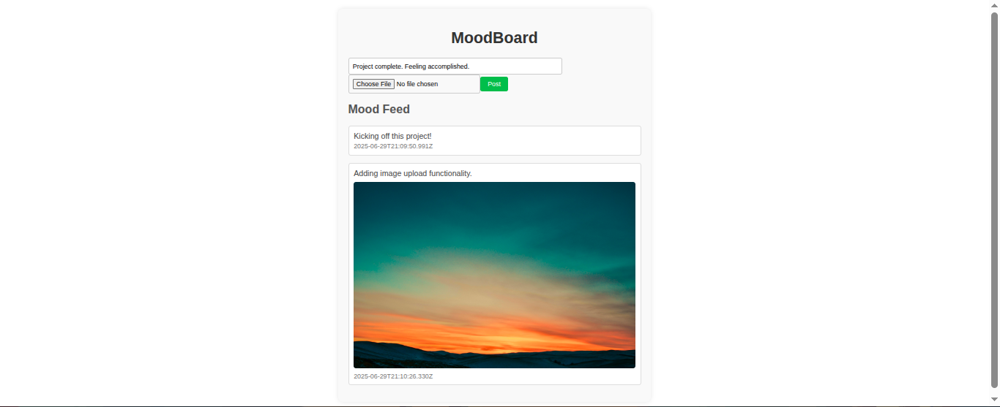

# MoodBoard - A Simple Mood Sharing Platform

## Project Overview
MoodBoard is a full-stack web application that allows users to submit short mood posts, optionally attach an image, and view a shared feed of all submitted entries.

## Setup and Run Instructions
1. Clone the repository: `git clone https://github.com/pratim808/MoodBoard-local.git`
2. Navigate to the backend folder: `cd MoodBoard/backend`
3. Install dependencies: `npm install`
4. Start the backend server: `node server.js`
5. Open another terminal, navigate to the frontend folder: `cd ../frontend`
6. Install dependencies: `npm install`
7. Start the frontend development server: `npm run serve`
8. Open your browser and go to `http://localhost:8080`

## Screenshots
> 

## Notes on Improvements or Limitations
- Mood entries are stored in memory and lost on server restart. A database (e.g., MongoDB) could add persistence.
- No user authentication; anyone can post or view the feed.
- Image uploads lack size/type validation, which could be added for security.
- The UI is basic and could use styling and feedback (e.g., loading spinners).

